:css: css/presentation.css

.. title:: Oldskool coding on Atari 2600/VCS

Oldskool coding on Atari 2600/VCS
=================================

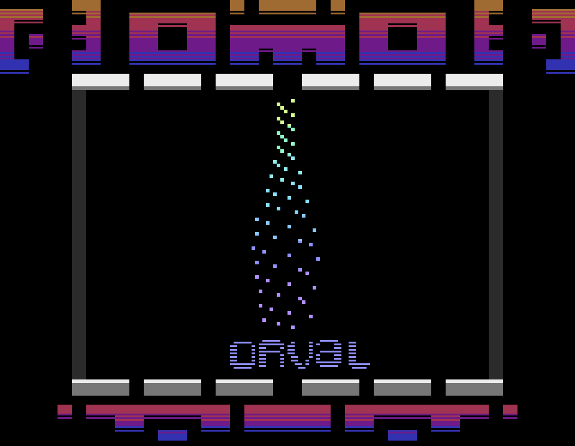

Florent Flament (contact@florentflament.com)

====

Demoscene
=========

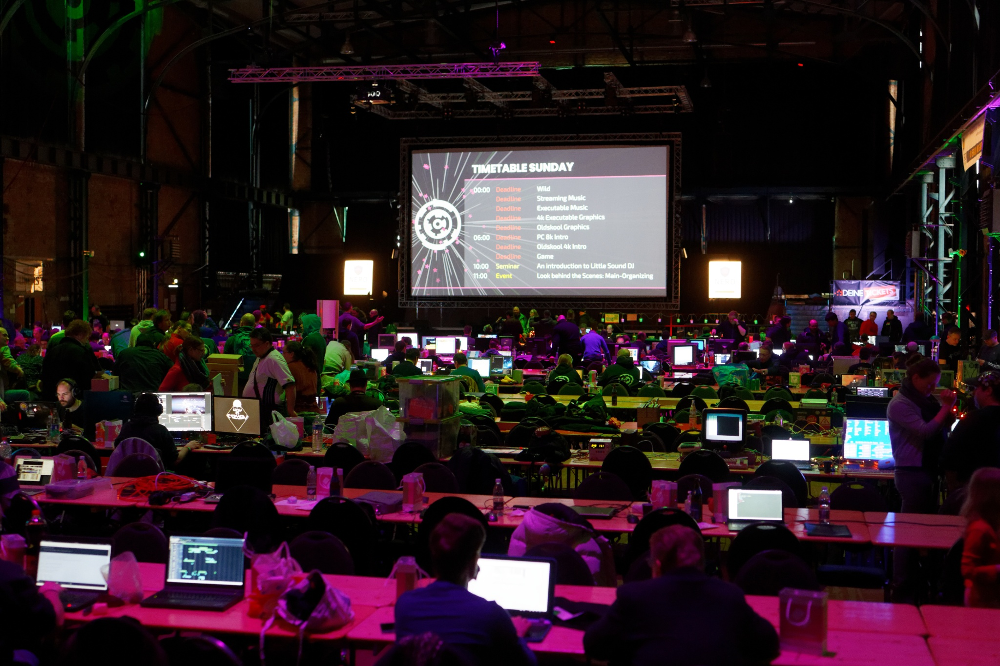

====

Computer art subculture
-----------------------

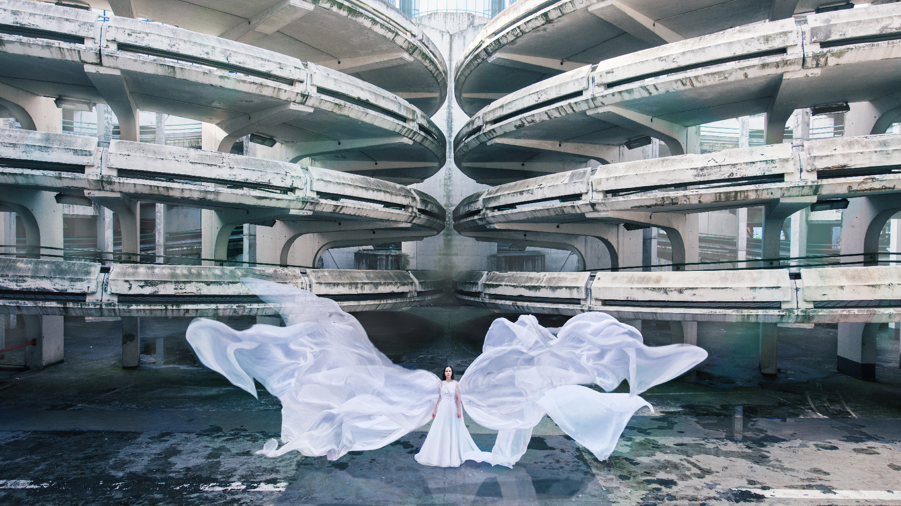

* Demoparties

* Demo competitions (compos)

* Real time animated drawings, effects, 3D models, music

.. note::

   The demoscene is a form of computer art culture characterized by
   events called demoparties. These events gather tens to hundreds of
   participants (called demosceners or sceners), most of them
   participating to organized competitions (called compos). During
   these compos, groups of sceners present their so-called demos,
   consisting of animated drawings, effects, 3D models and musics put
   together programmatically and in real time. Although demoscene
   groups may have dozens of members, demos are usually made by small
   teams consisting of 2-4 people (for instance, a graphic artist, a
   musician and a coder). Most demoparties also host musics, graphics,
   and sometimes photos competitions.

====

Born in 1980s as "copyparties"
..............................

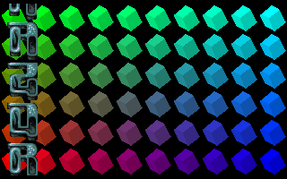

* Copy and crack software

* Cracktros

* Fork between crackscene and demoscene

.. note::

   Demoparties originate from copyparties happening in the 1980s,
   where computer enthusiasts met together to copy (and crack)
   software. Cracker groups usually added a short intro (animated
   graphics with music) to the software they cracked. Later in the
   1980s, groups focusing on making demos, rather than cracking
   software appeared leading to a fork between the "crackscene" and
   the "demoscene".

====

Still dozens of demoparties every year
......................................

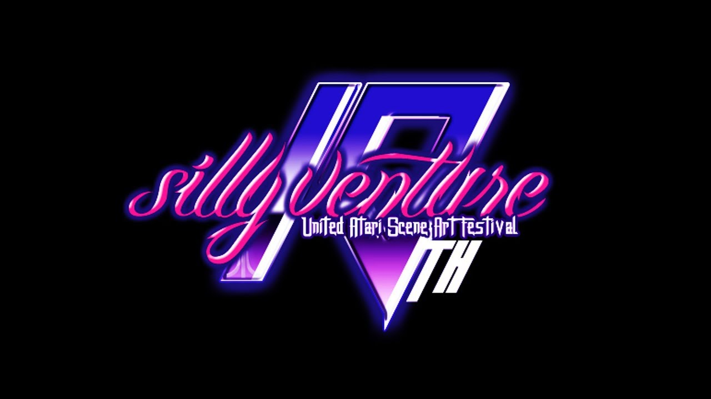

* Tens to hundreds of participants

.. note::

   As of today, there are still dozens of demoparties happening
   (mostly in Europe - like the Revision, Evoke and Assembly parties)
   every year, usually gathering dozens to hundreds of participants
   (Revision 2018 hosted around 700 participants).

====

PC demos
--------

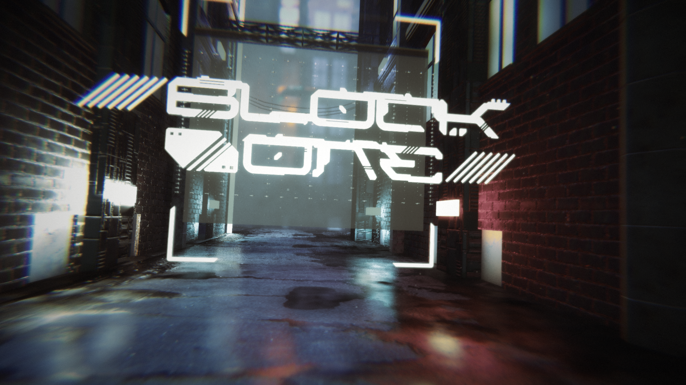

* PC compos

* Oldskool compos

.. note::

   During demoparties, the two main categories of competitions are PC
   compos and oldskool compos.

   PC demos make heavily use of the latest graphic cards' hardware
   capabilities, to display real time animated 3D scenes with effects
   involving millions of polygons and/or particles.

====

Limited size demos
..............................

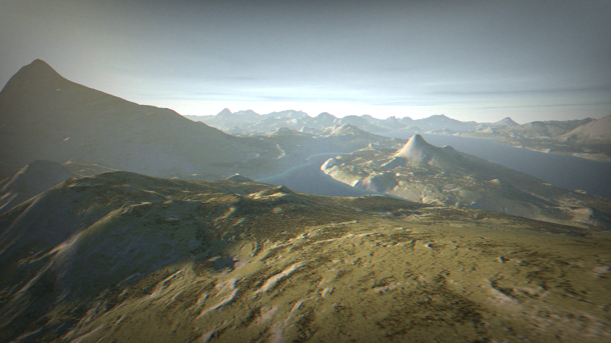

* 4K to 64K

* Procedural graphics

* 3D models compression

.. note::

   Among PC compos, we can find "limited size demos (or intros)". The
   rule is quite simple. To participate in such compo, the size of the
   demos submitted (usually binary files) must be smaller or equal to
   the size limit set for the competition. Usual sizes vary between 4k
   (4 KiloBytes) and 64K. Most of these demos heavily rely on
   procedural graphics, i.e graphics that are created in real time
   based on mathematical functions. This avoids storing to many 3D
   models, which are usually expensive in term of data size. In 64K
   demos, a limited amount of 3D models may be used, in which case
   powerful compression tools (the most well known being Crinkler_)
   are used to save space.

====

Unconstrainted demos
....................

* No size constraints

* Use of frameworks

.. note::

   Then we have the so-called "PC demos", which aren't constrained,
   though they must still be rendered in real time. Most of these
   demos are made using frameworks, like Unity_ (a commercial software
   meant to build video games), Notch_ (a tool developped and
   commercialized by Fairlight, a famous demoscene group, to build
   demos and visuals) or custom frameworks. These demos are mostly
   driven by visual artists who are able to create deep, beautiful and
   original 3D scenes.

====

Shader showdown
.............................

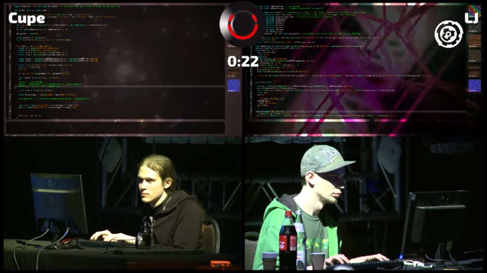

* Live coding

* Fragment shader

* Ray marching

.. note::

   Eventually, some parties (like Revision_) host so-called shader
   showdown shows. These consist in live coding performances where two
   programmers compete during 25 minutes to build the best demo-like
   visual, solely relying on the "fragment shader" capability of the
   compo machine graphic card. The principle of these shaders,
   programmed in GLSL (a C-like language compiled by the graphic card
   driver into a bytecode interpreted by the GPU), is that the image
   or scene being displayed is computed in real time pixel per pixel,
   in parallel, as modern graphic cards have thousands of computing
   units. The most widely used technique to program these shaders is
   called ray marching, as it allows to quickly create sophisticated
   3D scenes. Communities around shaders have emerged and code is
   being shared on websites like Shadertoy_ (the most widely known).

====

Oldskool demos
--------------

.. image:: pics/C64_startup_animiert.gif

* 8-bit / 16-bit platforms

* From pushing the hardware

* To making original contrained productions

.. note::

   On the other side of the spectrum, we have the oldskool
   demos. These are made for 8bit or 16bit computers (like the
   Commodore 64, the Atari ST or the Amiga 500) and game consoles
   (like the Atari 2600/VCS, the Nintendo Famicom or the Sega
   Megadrive). Most of these machines have been commercialized in the
   1980s and early 1990s, and have much less capabilities than modern
   PCs. Demos have been made on these platforms since the 1980s, when
   demosceners mostly focused on pushing them as far as they could in
   order to produce the most astonishing effect. Nowadays, the focus
   on these platforms has shifted; they are being used for the
   challenge of making a beautiful and original production (usually
   coded in assembler), while complying with these platforms'
   constraints (limited colors, graphic resolution, sound capability,
   memory and computing power). Another goal is to make these
   platforms live and avoid them to be forgotten.

====

Unlimited size oldskool demos
.............................

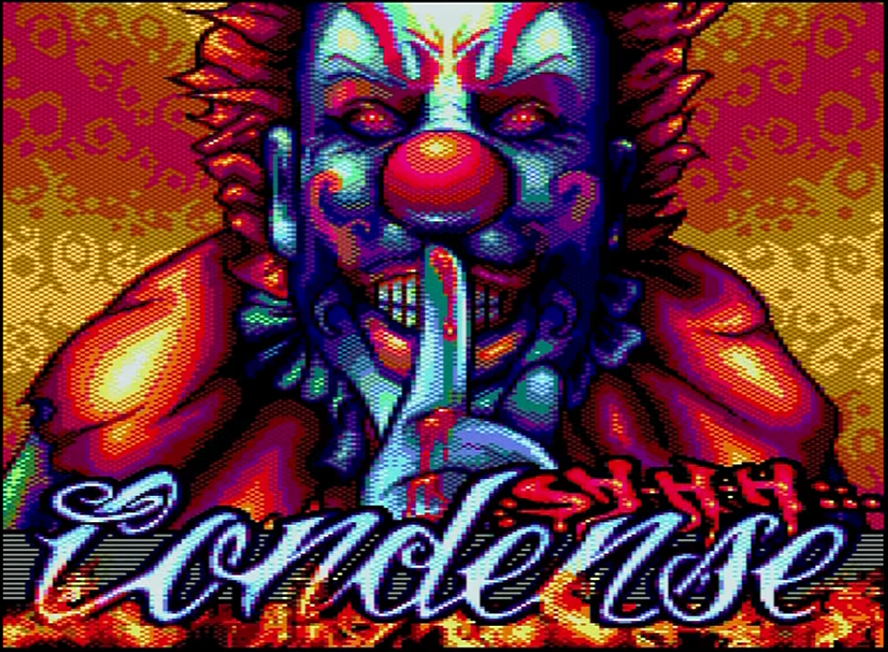

* Constrained by the platforms' capabilities

* Constrained by the size of the platforms' mediums

* Enough room for high quality graphics

.. note::

   Depending on the demoparty, there may be several categories where
   oldskool demos are competing. In generalist demoparties (like
   Revision and Evoke), all the oldskool platforms are regrouped into
   a single "oldskool" category (constrained by the size of the
   platform's medium, i.e one or two disks).

====

Limited size oldskool demos
...........................

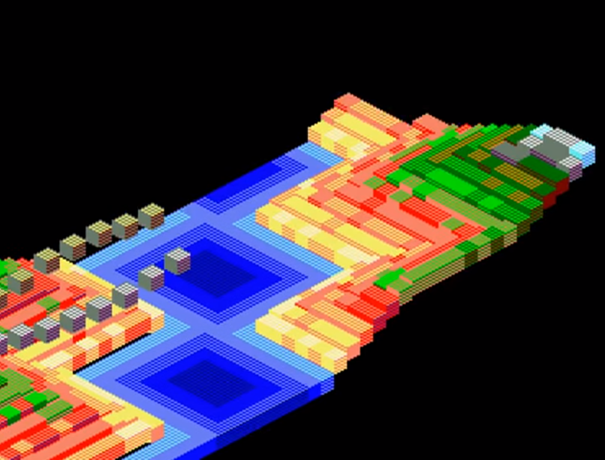

* 4K intros

* Hard to fit graphics

.. note::

   Some parties propose limited size compos, like the oldskool 4K
   intro compo of the Revision party. However, the overall difference
   between a 4K oldskool intro and an unconstrained oldskool demo is
   much less significant than between size limited and unconstrained
   PC demos. As we have seen previously, the size limitation in the PC
   world has for consequence a completely different approach in the
   way a demo is made. In the oldskool world, 4K intros are relatively
   similar to unconstrained demos, although being shorter, involving
   only one or a few effects, and without high resolution graphics.

====

Per platform compos
...................

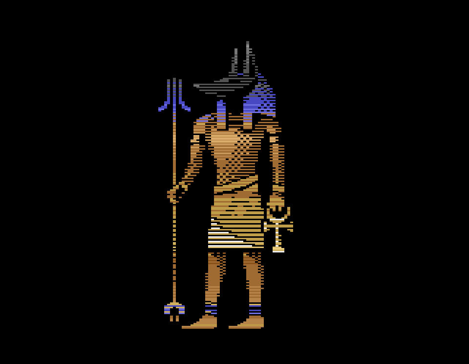

* Very different platforms' capabilities

* Specialized parties

.. note::

   That said, there is a drawback in parties having a single oldskool
   demo category. Oldskool platforms have very different capabilities,
   and these demos are not always judged by taking into account the
   constraints of the platform they are running on. For instance, the
   Atari 2600/VCS, commercialized in 1977, has 128 bytes of RAM, a
   1MHz 8bit CPU, a very basic sound chip producing mostly untuned
   notes, and a very basic video chip, that needs to be updated at
   every scanline (i.e hundreds of times per second) in order to
   produce rich graphics, therefore consuming most of the CPU power
   just for doing the display. On the other hand, the Atari ST,
   commercialized in 1985, has 512 KBytes to 4 MBytes of RAM, a 8MHz
   16bit CPU, a pretty good sound chip and a video frame buffer. For
   these reasons, in more specialized parties like the `Silly
   Venture`_, focusing on Atari platforms, we can find per platform
   competitions (Atari 2600/VCS, Atari 8bit, Atari ST, Atari Falcon),
   though there may be less entries per compo.

====

Community
---------

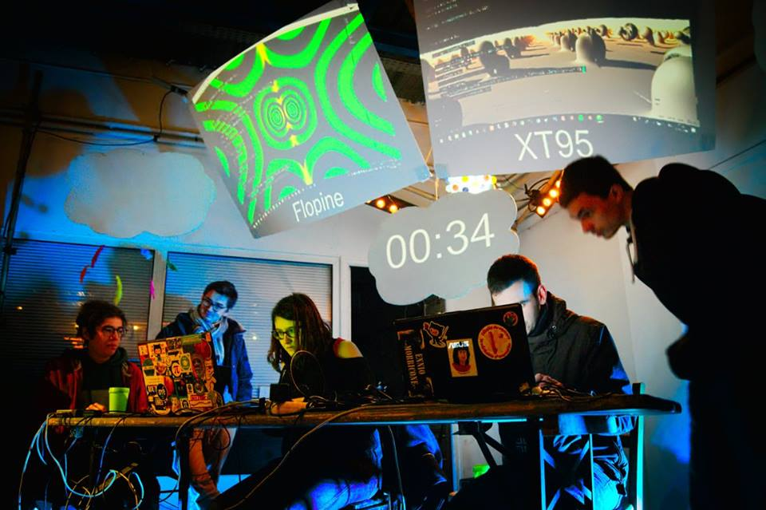

* Local events (Seminars, Beetros)

.. note::

   The demoscene is a very tight community. In addition to the many
   demo parties organized every year, a lot of (smaller) local events
   happen in some cities (Beetros where demosceners meet to drink a
   beer, or demoscene related conferences and events).

====

Online community
................

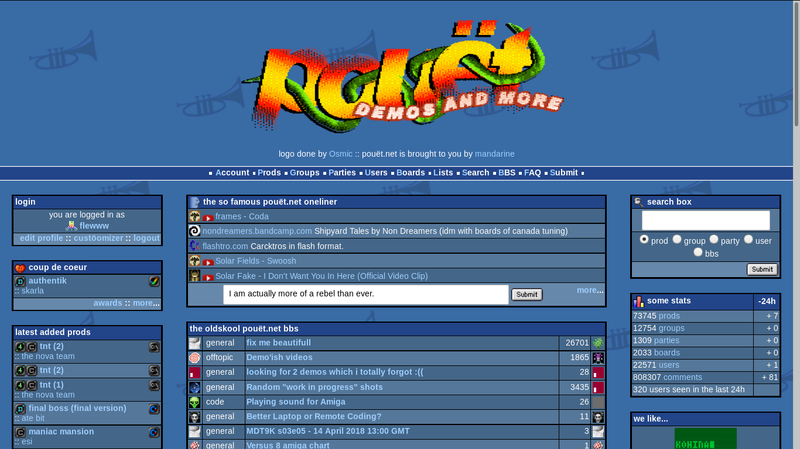

* Twitch - live streams

* Pouet - reference demoscene forum

* Demozoo - archive

* Specialized forums (Atariage, CPCWiki, ...)

.. note::

   Besides, the community is very active online. Most events are live
   streamed through the Twitch_ platform, which also stores the videos
   so that they keep being available online. Most demo parties also
   host technical seminars, which are recorded and available online
   too. Additionally, two websites serve as reference for demosceners:

   * Pouet_ is the reference forum of demosceners. Every demo is
     published on this website with every related information: the
     authors of the demo, the date of the release, the party it has
     been released at, the category, the rank, and possible links
     (Online video, source code, ...). Members of the forum can then
     post comments as well as basic votes (like thumb up, thumb down)
     on a demo's page.

   * Demozoo_ has been created later. This is more oriented towards
     being an archive for demoscene related productions. While Pouet_
     focuses on demos, Demozoo_ also archives every graphic and music
     entry released during demoparties, with related information.

   Other demoscene related websites focus on specific topics or
   platforms, like Atariage_ hosting the biggest Atari community with
   its forum, or CPCWiki_ being more or less the equivalent for the
   Amstrad CPC platform. Some demoscene groups also have their
   website, where they may share tools to make demos. And demosceners
   make heavily use of IRC to discuss.

====

Atari 2600/VCS
==============

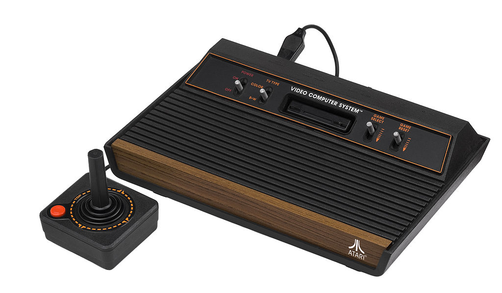

* Basic hardware

* Infinite possibilities

.. note::

   Why I chose to work on the Atari 2600/VCS platform ? I'd say that
   it's about the challenge of doing something interesting, with the
   simplest (or at least most basic) existing hardware on earth, that
   can do graphics and sound.

====

Relative complexity (Datasheet)
-------------------------------

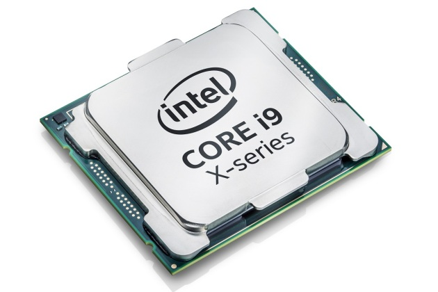

* Atari 2600: 57 pages

* 8th gen Intel Core Processor family: 681 pages

* Atmel ATmega328: 441 pages

.. note::

   To assess the relative complexity of the Atari 2600 platform
   compared to modern chips, here are some statistics about the
   datasheet's size of the Atari 2600 versus an 8th generation Intel
   Core processor and a modern low-end microcontroller.

   * The Atari 2600/VCS specification fits in a 57 pages document
     called `Stella programmer's guide`_

   * The `8th Generation Intel Core Processor Family datasheet`_ is
     spread over 3 documents for a total of 681 pages:

     - platform datasheet vol 1 (155 pages)

     - platform datasheet vol 2 (488 pages)

     - spec update (41 pages)

   * The `Atmel ATmega328/P datasheet`_ weights 441 pages. For $2, the
     microcontroller embeds:

     - an AVR 8bit CPU running at up to 20 MHz

     - 32 KBytes of Flash memory

     - 1 KBytes EEPROM

     - 2 KByes SRAM

     - many peripherals including

       * three timers (two 8-bit and one 16-bit)

       * a programmable Serial USART interface

       * an ADC (Analog to Digital converter) and a DAC (Digital to
         Analog Converter)

====

Relative complexity (Instructions set)
--------------------------------------

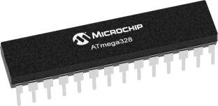

* 6502: 56 instructions

* x86-64 ISA: 981-3683 instructions

* 8-bit AVR: 142 instructions

.. note::

   We can also compare the size of the 6502 processor instructions set
   versus today's high-end CPUs like the x86-64 family and low-end
   modern CPUs like the 8-bit AVR:

   - The 6502 CPU implements 56 (legal) instructions.

   - The x86-64 ISA (Instruction Set Architecture) counts between 981
     and 3683 disctinct instructions depending on what we consider a
     unique instruction (souce: `How Many x86-64 Instructions Are
     There Anyway`_).

   - The 8-bit AVR counts 142 instructions (again this number can vary
     depending on how these are counted).

   Be it on the size of its datasheet or its CPU instructions set, the
   Atari 2600 is much simpler than modern chips. Its datasheet's size
   is roughly 10 times smaller than modern chips', and it has 3 times
   less instructions than the 8-bit AVR and 40 times less instruction
   than x86-64 processors.

   Q: What about CPU registers ?

====

Specifications
--------------

6502 CPU
........

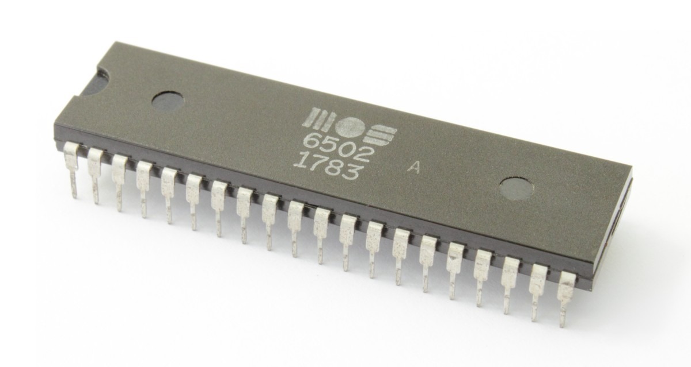

* Commercialized in 1977

* 56 instructions

* 5 8-bit registers + 16-bit PC

.. note::

   The Atari 2600/VCS has been commercialized in 1977, and was shipped
   with a 1 MHz 8bit 6507 CPU from MOS Technology (i.e a 6502 in a
   smaller package) with the following characteristics:

     * 56 (legal) instructions including ADC (8-bit integer addition
       with carry) and SBC (8-bit integer substraction with
       carry). The CPU doesn't support multiplications nor
       divisions. And floating point arithmetic is not supported
       neither.

     * The CPU provides five 8-bit registers and a 16-bit program
       counter:

       - A (The accumulator is used for arithmetic and logic
            operations)

       - X and Y (The index registers allow accessing data using a
                  base address and an offset).

       - P (The processor status flags, providing information about
            the last instructions executed, like whether there was a
            carry, if the last number manipulated was zero, ...)

       - S (The stack pointer is an index that points to the next
            empty slot available in the stack).

       - PC (The 16-bit program counter, which points towards the next
             instruction to be executed).

====

6532 RIOT
.........

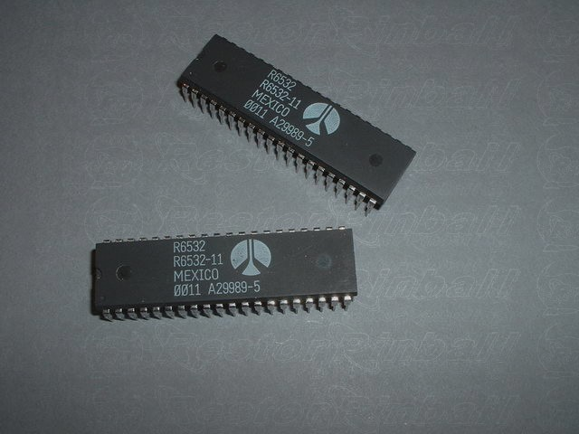

* 128 bytes of RAM

* 8-bit timer

* two 8-bit parallel I/O ports

.. note::

   It embeds two additional chips. The PIA (Peripheral Interface
   Adaptor) is an off-the-shelf 6532 RIOT (RAM-I/O-Timer) chip
   providing:

     * 128 bytes of RAM.

     * An 8bit programmable timer, that can be setup based on
       different possible intervals, and then read through the
       following registers:

       - TIM1T (1 clock intervals timer setup)
       - TIM8T (8 clocks intervals timer setup)
       - TIM64T (64 clocks intervals timer setup)
       - T1024T (1024 clocks intervals timer setup)

       - INTIM (timer output - provides the number of timer intervals
                remaining)
       - TIMINT (timer interrupt - becomes non null when the timer has
                 expired)

     * Two 8bit parallel I/O ports:

       - Port B (SWCHB) is hardwired to read the status of the
         console's switches.

       - Port A (SWCHA) can be configured on a per bit basis (through
         the SWACNT register) to act as input or output. That said, it
         is mostly used to connect up to two joysticks. Each of the
         four most significant bits is associated to a direction of
         player 0, while the four least significant bits are
         associated to the direction of player 1. This port can also
         be used to read paddle triggers.

====

TIA
...

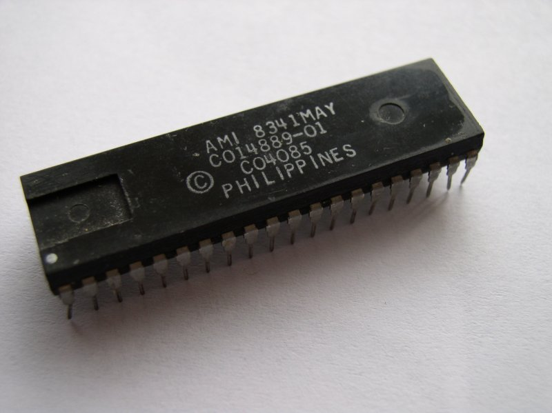

* 35 writable registers for graphics

* 6 writable registers for audio

* 4 writable registers for TV synchronization

* 14 readable registers for joystick and collisions

.. note::

   The Atari 2600 also embeds a custom integrated circuit, the TIA
   (Television Interface Adaptor), responsible for displaying the TV
   picture and playing the sound, by exposing:

     * 45 writable registers for graphics, audio and screen
       synchronization.

     * 14 readable registers to get part of joystick input and detect
       sprites collisions.

   It has been built with games like pong or tank in mind. The TIA's
   registers reflect this mindset. Following is how Atari designed the
   this chip according to what they considered the "primitives" to
   build video games (each register uses between 1 and 8 bits):

     * 4 write registers are used for the screen synchronization:
       - VSYNC (vertical sync set-clear)
       - VBLANK (vertical blank set-clear)
       - WSYNC (wait for leading edge of horizontal blank)
       - RSYNC (reset horizontal sync counter)

     * 6 write registers used to drive 2 audio channels:
       - AUDC0 (audio control 0)
       - AUDC1 (audio control 1)
       - AUDF0 (audio frequency 0)
       - AUDF1 (audio frequency 1)
       - AUDV0 (audio volume 0)
       - AUDV1 (audio volume 1)

     * 35 write registers dedicated to displaying graphics:

       * 6 registers are available for background and "playfield" graphics:
         - COLUBK (color-lum background)
         - COLUPF (color-lum playfield)
         - PF0 (playfield register byte 0)
         - PF1 (playfield register byte 1)
         - PF2 (playfield register byte 2)

       * 12 registers available to display 2 sprites (called players):
         - COLUP0 (color-lum player 0)
         - COLUP1 (color-lum player 1)
         - REFP0 (reflect player 0)
         - REFP1 (reflect player 1)
         - RESP0 (reset player 0)
         - RESP1 (reset player 1)
         - GRP0 (graphics player 0)
         - GRP1 (graphics player 1)
         - HMP0 (horizontal motion player 0)
         - HMP1 (horizontal motion player 1)
         - VDELP0 (vertical delay player 0)
         - VDELP1 (vertical delay player 1)

       * 8 registers available to display 2 missiles:
         - RESM0 (reset missile 0)
         - RESM1 (reset missile 1)
         - ENAM0 (graphics (enable) missile 0)
         - ENAM1 (graphics (enable) missile 1)
         - HMM0 (horizontal motion player 0)
         - HMM1 (horizontal motion player 1)
         - RESMP0 (reset missile 0 to player 0)
         - RESMP1 (reset missile 1 to player 1)

       * 4 registers to display 1 ball:
         - RESBL (reset ball)
         - ENABL (graphics (enable) ball)
         - HMBL (horizontal motion ball)
         - VDELBL (vertical delay ball)

       * 5 registers used to setup, and postion the playfield, sprites and
         missiles:
         - CTRLPF (control playfield, ball size & collisions)
         - NUSIZ0 (number-size player-missile 0)
         - NUSIZ1 (number-size player-missile 1)
         - HMOVE (apply horizontal motion)
         - HMCLR (clear horizontal motion registers)
         - CXCLR (clear collision latches)

     * 8 read registers to read collisions between the 5 objects
       supported by the platform (2 players, 2 missiles, 1 ball and
       the playfield):
       - CXM0P (read collision D7:M0/P1 D6:M0/P0)
       - CXM1P (read collision D7:M1/P0 D6:M1/P1)
       - CXP0FB (read collision D7:P0/PF D6:P0/BL)
       - CXP1FB (read collision D7:P1/PF D6:P1/BL)
       - CXM0FB (read collision D7:M0/PF D6:M0/BL)
       - CXM1FB (read collision D7:M1/PF D6:M1/BL)
       - CXBLPF (read collision D7:BL/PF D6:unused)
       - CXPPMM (read collision D7:P0/P1 D6:M0/M1)

     * 6 read registers to get input from the paddles, as well as the
       joysticks' trigger buttons:
       - INPT0 (read pot port)
       - INPT1 (read pot port)
       - INPT2 (read pot port)
       - INPT3 (read pot port)
       - INPT4 (read input)
       - INPT5 (read input)

   Finally, the Atari 2600/VCS supports ROM cartridges with a capacity
   of 4 KBytes (first cartridgess) to 32 KBytes (using a bank
   switching trick).

   The `Stella Programmer's guide`_ (by Steve Wright - 1979) provides
   all the information required to program the platform.

====

The toolchain
-------------

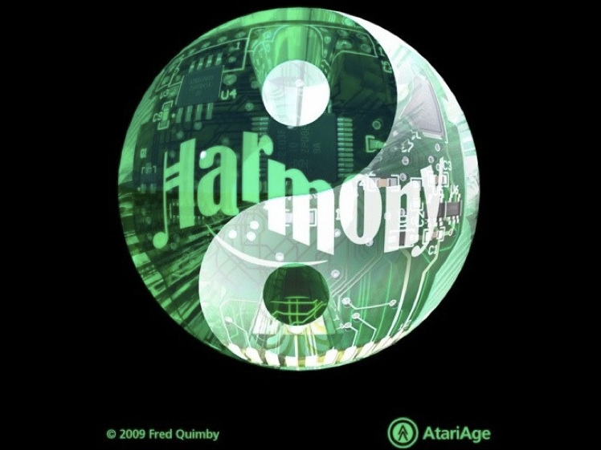

* DASM assembler

* Stella emulator

* Harmony cartridge

.. note::

   The only tools we need to start coding for the Atari 2600/VCS
   platform are:

   * An assembler supporting the 6502 processor. The examples here can
     be compiled with DASM_.

   * An Atari 2600 emulator, like Stella_, which embeds a powerful
     debugger.

   * An Atari 2600 console, with a `Harmony cartridge`_, which allows
     launching roms stored on an SSD card on an Atari VCS console.

   To build an executable Atari binary from the assembler source code
   and have it run on the emulator, one can use the following
   commands:

====

Build & Launch
..............

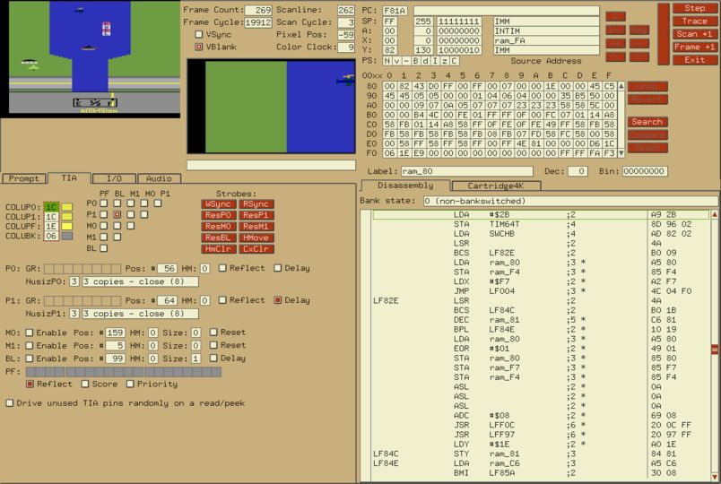

.. code:: sh

   $ dasm sync.asm -f3

   Complete.

   $ stella a.out

====

Graphics coding
---------------

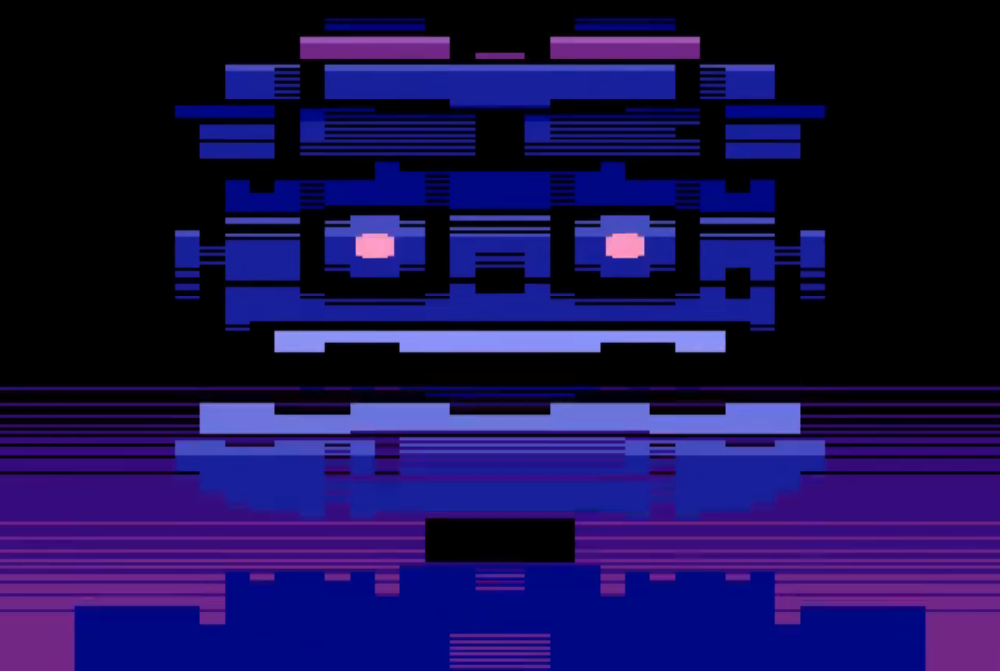

====

Synchronization
...............

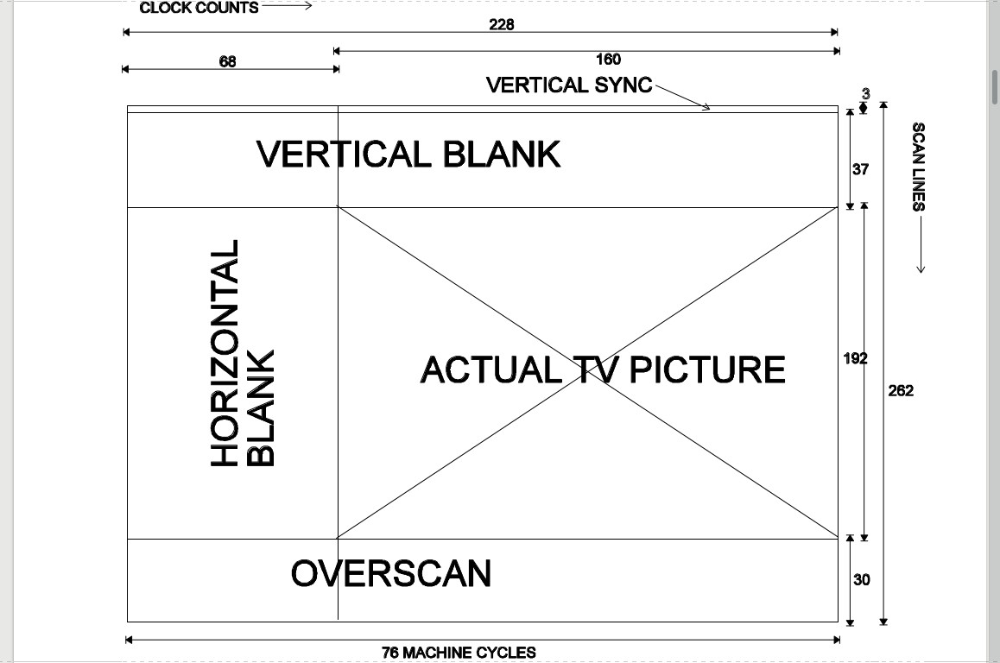

* Automatic horizontal sync

* CPU driven vertical sync

.. note::

   The minimal code running on the Atari to display a picture must
   deal with the synchronization of the TV beam. A couple of registers
   are available for this purpose; the timer as well can be used to
   synchronize the code with the TV beam.

   The TIA handles automatically the horizontal synchronization. It
   generates the horizontal sync signal (HSYNC) when the beam reaches
   the right edge of the screen, to have it turned off and return to
   the left edge. However, it often happens that the CPU needs to
   synchronize itself with the beam to update the graphic registers on
   a per line basis. For that purpose, the WSYNC (Wait for SYNC)
   strobe register, when written to, stops the processor until the
   beam reaches the right edge of the screen, then turns the processor
   back on, so that it can update the relevant registers for the next
   line to be displayed. That way the CPU can deterministically
   execute code in sync with the TV beam.

   Depending on the TV standard of the console and the TV (NTSC or
   PAL), a vertical sync (VSYNC) signal has to be sent every 262 lines
   for an NTSC setup (resulting in a 60 Hz refresh rate) or every 312
   lines for a PAL setup (for a 50 Hz refresh rate). It is the
   responsability of the microprocessor to handle the vertical
   synchronization by:

   * writing a '1' to D1 of the VSYNC register to turn on the vertical
     sync signal,

   * then waiting for at least 3 scanlines to signal the TV to
     reposition its beam at the top of the screen,

   * writing a '0' to D1 of VSYNC to turn off the VSYNC signal,

   * then writing a '1' to D1 of the VBLANK register to turn off the
     beam during its repositioning,

   * counting 37 lines (NTSC) or 45 lines (PAL), to let the beam go
     back to the top of the screen (Note that the CPU can use this
     time to perform some computation),

   * eventually, the CPU will have to write a '0' to D1 of VBLANK to
     turn the beam back on.

====

Minimal code
............

.. code::

   main_loop:
           ; Write '1' to D1 of VSYNC
           lda #$02                ; This corresponds to the 00000010 byte
           sta VSYNC

           ; Wait 3 scanlines
           sta WSYNC
           sta WSYNC
           sta WSYNC

           ; Write '0' to D1 of VSYNC
           lda #$00
           sta VSYNC

           ; Write '1' to D1 of VBLANK
           lda #$02
           sta VBLANK

           ; Count 45 lines for VBLANK
           ldx #45
   vblank_loop:
           sta WSYNC
           dex
           bne vblank_loop

           ; Write '0' to D1 of VBLANK
           lda #$00
           sta VBLANK

           ; Count 312 - 48 = 264 lines
           ; in two passes of 132 (max counter value is 255)
           ldy #2
   outer_loop:
           ldx #132
   inner_loop:
           sta WSYNC
           dex
           bne inner_loop
           dey
           bne outer_loop

           jmp main_loop

====

VERTICAL_SYNC macro
...................

.. code::

   main_loop:
           VERTICAL_SYNC

           ; Write '1' to D1 of VBLANK
           lda #$02
           sta VBLANK

           ; Count 44 lines for VBLANK
           ldx #44
   vblank_loop:
           sta WSYNC
           dex
           bne vblank_loop

           ; Write '0' to D1 of VBLANK
           lda #$00
           sta VBLANK

           ; Count 312 - 48 = 264 lines
           ; in two passes of 132 (max counter value is 255)
           ldy #2
   outer_loop:
           ldx #132
   inner_loop:
           sta WSYNC
           dex
           bne inner_loop
           dey
           bne outer_loop

           jmp main_loop

====

Blinking screen
...............

.. code::

   ;---------- RAM segment ----------
           SEG.U ram
           ORG $0080
   frame_cnt ds 1

   ;---------- Code segment ----------
           SEG code
           ORG $F000
           CLEAN_START

   main_loop:
           VERTICAL_SYNC

           ; Write '1' to D1 of VBLANK
           lda #$02
           sta VBLANK

           ; Vblank header logic
           inc frame_cnt
           lda frame_cnt
           lsr
           sta COLUBK

           ; Count 44 lines for VBLANK
           ldx #44
   vblank_loop:
           sta WSYNC
           dex
           bne vblank_loop

====

Music coding
------------

====

Team collaboration
==================

Team members
------------

Collaboration tools
-------------------

Collaboration process
---------------------

====

Atari VCS demos
===============

.. _Crinkler: http://crinkler.net/
.. _`Stella programmer's guide`: http://atarihq.com/danb/files/stella.pdf
.. _`8th Generation Intel Core Processor Family datasheet`: https://www.intel.com/content/www/us/en/processors/core/core-technical-resources.html
.. _`Atmel ATmega328/P datasheet`: http://ww1.microchip.com/downloads/en/DeviceDoc/Atmel-42735-8-bit-AVR-Microcontroller-ATmega328-328P_Datasheet.pdf
.. _`How Many x86-64 Instructions Are There Anyway`: https://stefanheule.com/blog/how-many-x86-64-instructions-are-there-anyway/
.. _DASM: https://github.com/munsie/dasm
.. _Stella: https://stella-emu.github.io/
.. _Unity: https://unity3d.com/
.. _Notch: https://www.notch.one/
.. _Revision: https://2018.revision-party.net/
.. _Shadertoy: https://www.shadertoy.com/
.. _`Silly Venture`: http://sillyventure.eu/en/
.. _Twitch: https://www.twitch.tv/
.. _Pouet: http://www.pouet.net/
.. _Demozoo: https://demozoo.org/
.. _Atariage: https://atariage.com/
.. _CPCWiki: http://www.cpcwiki.eu/index.php/Main_Page
.. _`Harmony Cartridge`: http://harmony.atariage.com/Site/Harmony.html
